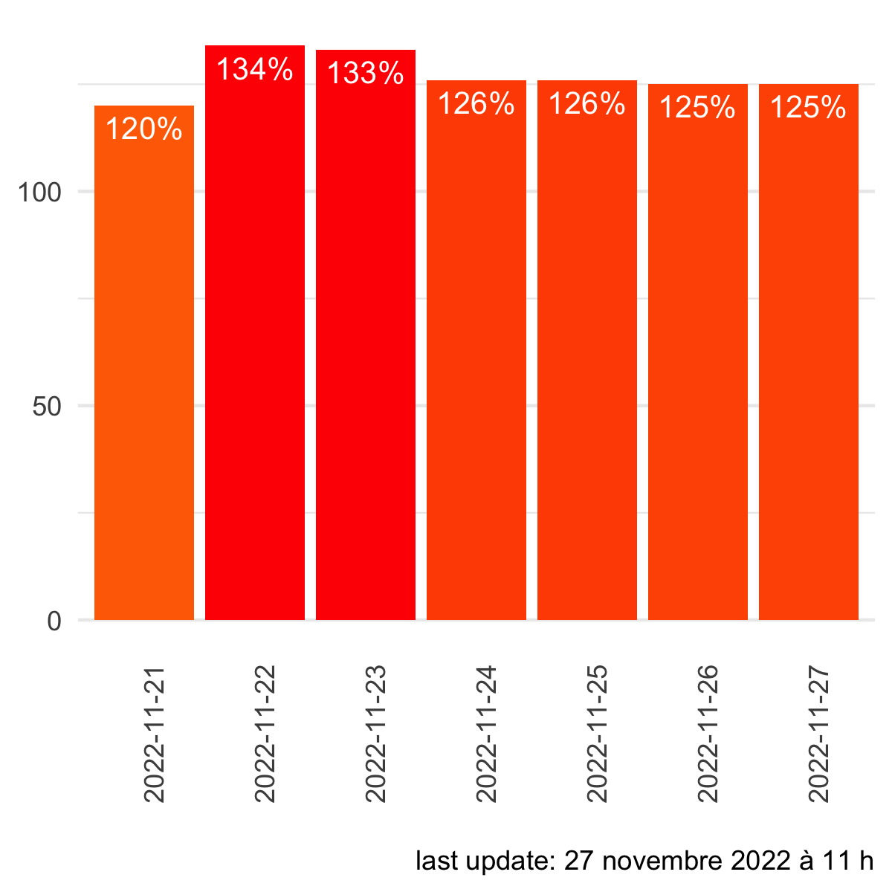

# pdfscraper
* pdfscraper that extracts table in pdf and saves data to csv 
* runs every day around 1pm (17 utc)
* currently runs as backup in case data collection for
<a href = "https://jlomako.shinyapps.io/occupancy_app/">hospital tracker</a>
fails
  

  

### mean occupancy rates in Montréal emergency rooms (last 7 days)

  

### note to myself about some problems I ran into:
* loading R package "pdftools" resulted in errors -->
 <a href="https://github.com/r-lib/actions/issues/78#issuecomment-611733294">solution</a>: use runner "macos-10.15" and install XQuartz before pdftools is installed: Add <code>run: brew install xquartz --cask</code> to yml file 
* GH stopped supporting macos-10.15 this summer, runs on macos-11 now
